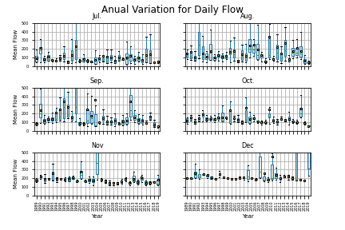

# Forecast Week 6
## *Name:* Camilo Salcedo
## *Date:* October 5th 2020
___

# Forecast description

Using a plot to show the mean flows for the months of July, August and September at each year within the analysis period, it was determined which years had a similar behavior during those months historically. In this sense, the most similar year for the second semester of the year was 2019.  Hence, an Auto Regressive models was developed considering a training period of time between August 25 2019 and November 17.

# Assignment Questions
## 1. A summary of the AR model that you ended up building, including (1) what you are using as your prediction variables, (2) the final equation for your model and (3) what you used as your testing and training periods. In your discussion please include graphical outputs that support why you made the decisions you did with your model.
The developed Auto-Regressive model includes 3 lags, representing an AR(3) model. The variables used for the prediction were Z(t-1), Z(t-2) and Z(t-3). Hence, the equation of the model is:
Zt = 9.67 + 0.89Z(t-1) - 0.2Z(t-2) + 0.27Z(t-3)

For the development of the model, a period between 25/08/2019 and 17/11/2019. The use of this training period was determined as a result of the analysis of behavior of the mean daily flow at each month between July and December along years. Hence, a similar year it was found that the most similar year in terms of the monthly average of flow was 2019. The corresponding box and whiskers plot, showing the mean value per year is shown below:

## 2. Provide an analysis of your final model performance. This should include at least one graph that shows the historical vs predicted streamflow and some discussion of qualitatively how you think your model is good or bad.

The developed model reach a determination coefficient (R2) of 0.90, which indicates a good correlation between the depending variables and the predicted variables. However, based on the seasonal behavior of the flow in Verde River, it is expected that if a higher amount of information was used, the R2 will decrease.

In conclusion, a short training period is a good approach to represent short periods of data as in this case, in where the training model was evluated between a training period of almost 8 weeks.

## 3.  Finally, provide discussion on what you actually used for your forecast. Did you use your AR model, why or why not? If not how did you generate your forecast this week?

Two different AR models were developed for the forecast, using two different samples for training period.
