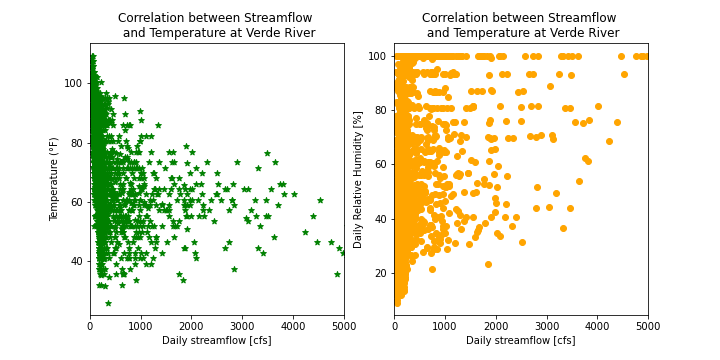
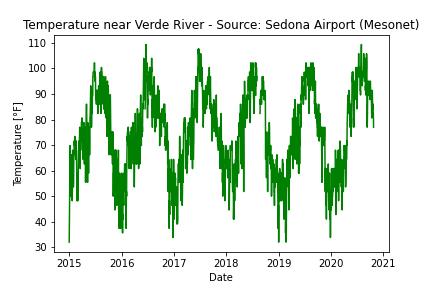
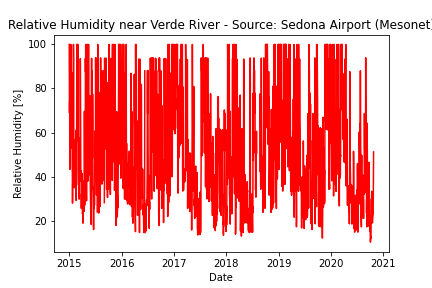

# Forecast Week 9 - ReadMe File
## *Name:* Camilo Salcedo
## *Date:* October 26th 2020
___
### 1. A brief summary of the how you chose to generate your forecast this week.
For this week, I tried to incorporate two new datasets: Temperature and Relative Humidity, measured at Sedona's Airport and available at Mesonet. The selection of this location was because it was closer to the upstream area of Verde River's basin.

In the process of analysing the new datasets, I performed a correlation analysis between each dataset with the stream flow at Verde River. As a result, the temperature and relative humidity datasets showed a correlation with the stream flow of -0.27 and 0.25 respectively. The corresponding correlation plots are shown below:

Based on the weak correlation between the analyzed datasets with the stream flows, I decided to avoid them and perform the forecast (both weekly and seasonal) using just the flow dataset (USGS). Therefore, I used the functions developed for last week, obtaining the entries submitted.

### 2. A description of the dataset you added:

#### What is the dataset? Why did you choose it?

For this week, I selected two datasets: _Temperature_ and _Relative Humidity_, measured at Sedona Airport. The main reasons for this selection was that I wanted to explore different datasets from Precipitation. In this case, I thought that the datasets should also be related with the streamflow due to their relation with the rainfall before it occurs.

The _Temperature_ dataset is measured in an 20-minutes basis and retrieved in Farenheit degrees (F°). Meanwhile, the _Relative Humidity_ dataset is measured in an 20-minutes basis and retrieved as a percentage (%).

#### What location have you chosen?
The location for the station was in Sedona's Airport, in Arizona.

#### Where did you get the data from?
The data was retrieved from Mesonet.

#### What was your approach to accessing it?
First, I located Verde River as well as the USGS station that we have been using in the course. I tried to look for information in the upper part of the basin, given that the streamflow will be generated based on the behavior of rainfall in that region. However, I selected these datasets to analyze the effect of other variables different from precipitation in the streamflows.

#### A plot of your additional time series along with your streamflow time series.

The _Temperature_ dataset is shown below:

Meanwhile, the _Relative Humidity_ dataser is shown below:

