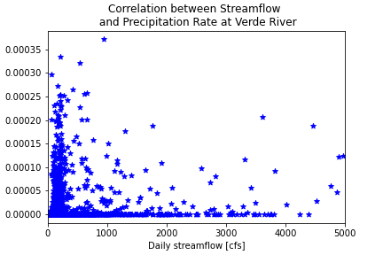
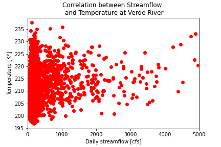
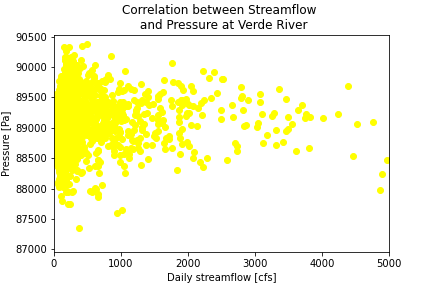
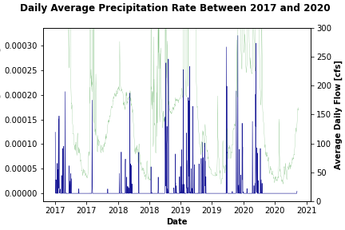
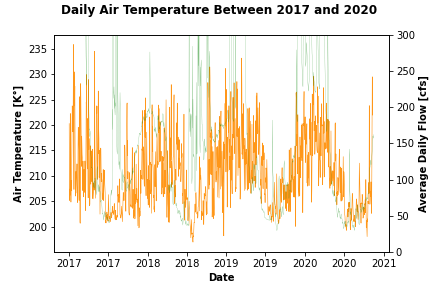
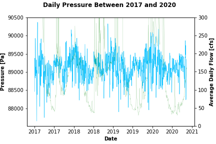

# Forecast Week 12 - ReadMe File
## *Name:* Camilo Salcedo
## *Date:* November 16th 2020
___
### 1. A brief summary of the how you chose to generate your forecast this week.
For this week, I decided to analyze three different datasets: Precipitation Rate (used by Laura in class), Air temperature and Pressure, obtained from the Physical Sciences Lab from the NOAA. The used datasets were downloaded as NCEP re-analysis data in format netCDF.

In the process of analysing the new datasets, I performed a correlation analysis between each dataset with the stream flow at Verde River. As a result, the Precipitation Rate, Air Temperature and Pressure datasets showed a correlation with the stream flow of 0.178, 0.177 and -0.025 respectively. The corresponding correlation plots are shown below:

Based on the weak correlation between the analyzed datasets with the stream flows, I decided to avoid them and perform the forecast (both weekly and seasonal) using just the flow dataset (USGS). Therefore, I used the functions _AR_model_estimate_ and _forecast_flows_ as part of the package _ar_functions_. These functions were developed in previous weeks, and improved last week during the team Forecast with The Aquaholics.

The periods considered during in the forecasts are described in the table below:

|AR Model|Training Start Date|Training End Date|R^2|
| ------ | ----------------- | --------------- | --- |
| ------ | ----------------- | --------------- | --- |
|Week (1 & 2)|2009-10-01|2009-11-30|0.9769|
|Seasonal - 1st 10 weeks|2017-08-25|2017-11-10|0.7673|
|Seasonal - Remaining weeks|2009-10-01|2009-11-30|0.9338|

Finally, the forecasts obtained for Week 1 & Week 2 were:

*1 Week: 2020-11-15 to 2020-11-22*: 165.12 cfs

*2 Week: 2020-11-22 to 2020-11-29*: 177.17 cfs

### 2. A description of the dataset you added:

#### What is the dataset? Why did you choose it?

For this week, I selected three datasets: _Precipitation Rate_, _Air Temperature_ and _Pressure_, measured at the extent between latitudes 34N and 36N and longitudes 247E to 249E. For this selection, I considered variables that are related with the runoff generated in a basin, and could possibly impact the precipitation.

The three datasets were obtained in the specified grid, from the Historical Re-analysis data from NOAA Physical Sciences Lab in a daily basis. First, the _Precipitation Rate_ dataset is measured in (kg/m^2/s); the _Air Temperature_ is measured in (°K) and the Pressure in Pascals (Pa).

#### What is the spatial and temporal resolution and extent of the data ?
The used grid is located between latitudes 34N and 36N and longitudes 247E to 249E.

#### Where did you get the data from?
The data was retrieved from the Physical Sciences Lab at NOAA.

#### What was your approach to extracting and aggregating it into something useful to you?
First, the data was extracted by following the instructions in the Assignment # 12. Saving the datasets in a folder data (available in Submissions), they were uploaded to Visual Code using the function _open_datasets_ from xarray.

Then, the latitude and longitude from each dataset (according to the indicated extent in the previous question) was obtained in order to request the information only for it at each dataset. After this, the data was extracted for each extent, and then converted to dataframes. Since this point, the analysis continued using datasets as dataframes indexed by their dates.

### 3. A plot of the dataset you added. This can be a timeseries, map, histogram or any other plot that you think is a good summary of what you added.

Each dataset was obtained between 2009-01-01 to 2020-11-01. However, they were plotted only between 2017 to 2020 to analyze their behavior.

The _Precipitation_Rate_ dataset is shown below. For comparison, the streamflow dataset was also plotted.

The _Air Temperature_ dataset is shown below. For comparison, the streamflow dataset was also plotted.

Finally, The _Pressure_ dataset is shown below. For comparison, the streamflow dataset was also plotted.

### 4. Finally add your plot and a brief summary of what you did to our slide deck for this week here
Done :)
