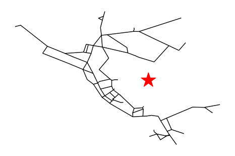
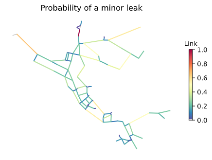

# Forecast Week 14 - ReadMe File
## *Name:* Camilo Salcedo
## *Date:* November 30th 2020

## Table of Contents:
1. [ Week 14 Forecasts ](#forecasts)
2. [ FAIR Science Experience](#fair_exp)

>## 1. Week 14 forecasts

### Weekly Forecasts

For the weekly results, an AR3 model was used. The training period and the coefficient of determination are shown in the table below.

|AR Model|Training Start Date|Training End Date|R^2|
| ------ | ----------------- | --------------- | --- |
| ------ | ----------------- | --------------- | --- |
|Week (1 & 2)|2017-10-01|2017-12-12|0.9918|

As a result, the obtained values for the forecast are:

_**1 Week (2020-11-22 to 2020-11-28):**_ 176.37 cfs

_**2 Week (2020-11-29 to 2020-12-05):**_ 192.96 cfs

### Seasonal Forecasts
For Seasonal Forecast, two AR3 Models were used using the parameters shown in the table below.

|AR Model|Training Start Date|Training End Date|R^2|
| ------ | ----------------- | --------------- | --- |
| ------ | ----------------- | --------------- | --- |
|Seasonal - 1st 10 weeks|2017-08-25|2017-11-17|0.8561|
|Seasonal - Remaining weeks|2017-10-01|2017-12-15|0.9886|

As a result, the forecasted values are shown below, measured in [cfs].

| Week 1 | Week 2 | Week 3 | Week 4 | Week 5 | Week 6 | Week 7 | Week 8 | Week 9 | Week 10 | Week 11 | Week 12 | Week 13 | Week 14 | Week 15 | Week 16 |
| ------ | ------ | ------ | ------ | ------ | ------ | ------ | ------ | ------ | ------- | ------- | ------- | ------- | ------- | ------- | ------- |
| 42.34  | 52.05  | 62.71  | 73.35  | 83.5   | 92.98  | 101.69 | 109.65 | 116.88 | 123.45  | 132.37  | 140.47  | 149.45  | 157.52  | 165.67  | 172.92  |

>## 2. FAIR Science Experience

#### 1. What is the paper or project you picked? Include a title, a link the the paper and a 1-2 sentence summary of what its about.

###### _A Software Framework for Assessing the Resilience of Drinking Water Systems to Disasters with an Example Earthquake Case Study_
**Authors:** Katherine A. Klise, Michael Bynum, Dylan Moriarty and Regan Murray

**Journal:** Environmental Modelling and Software.

**Link:**
https://www.sciencedirect.com/science/article/pii/S1364815216309501

The paper I picked presents the package Water Network Tool for Resilience (WNTR), which is designed to simulate and analyze resilience in water supply systems. Moreover, WNTR seeks to analyze the response to hazards and evaluate actions to improve the resilience of the system. In the article, an synthetic earthquake was used to present the capabilities of the tool.

#### 2. What codes and/or data are associated with this paper? Provide any link to the codes and datasets and a 1-2 sentence summary of what was included with the paper (i.e. was it a github repo? A python package?A database? Where was it stored and how?)

The data associated with the paper is available in the GitHub repository in the following link:

https://github.com/USEPA/WNTR

Given that the paper presents WNTR Tool, the repo includes a set of instructions for its setup and other documentation regarding some updates. Also, a set of examples and demos are included to familiarize the user with the capabilities of the tool.

#### 3. Summarize your experience trying to understand the repo: Was their readme helpful? How was their organization? What about documentation within the code itself?

My experience was very good, as the GitHub site provides straightforward instructions to setup the tool in my PC. In addition, it provides examples to use the tool not only to calculate fragility curves for earthquakes, but also for different capabilities such as leak simulation after disasters, pipe criticality analysis and the performance of stochastic simulations.

For the scope of this week's assignment, I only set up the repo, and run the examples. However, if I have to use the tool in further situations, the example codes will help me to develop the scripts easier.

The code itself is well commented. Despite of that, the Earthquake demo is presented as a notebook to follow the example, which is not so easy to understand as it is only commented and not explained. In this case, the approach of HAS-Tools taught me that the notebooks could be used to comment the results as a Markdown, which was something WNTR developers did not do.

#### 4. Summarize your experience trying to work with their repo: What happened? Where  you successful? Why or why not?

I was successful running their repo. The only trouble I had happened when I tried to switch into a new Python environment. When this was solved, the examples provided by WNTR developers ran good.

As an example, some of the plots resulted from the Jupyter Notebook are shown below:

1. A synthetic earthquake was generated with a magnitude of 6.5 in Richter scale, with a depth of 10,000 m. The location is shown in the graph in regards with Net3.

2. The simulated earthquake affected the pipes, producing some minor leaks as shown below.

3. The pressure in the network is shown in the figure below. It shows the comparison between the scenario repairing the pipes and one without them.

#### 5. Summarize your experience working with the data associated with this research. Could you access the data? Where was it? Did it have a DOI? What format was it in?

The DOI for the paper is:

**DOI**: 10.1016/j.envsoft.2017.06.022

I could access to the examples provided in the repo. They were Python scripts (.py), a Jupyter notebook, and some .inp files (for EPANET).

#### 5. Did this experience teach you anything about your own repo or projects? Things you might start or stop doing?

Absolutely. It taught me that in the future, my repos should be well organized, explained and commented in order to let other users to access and reproduce my research. This is one of the most important aspect of our work.
