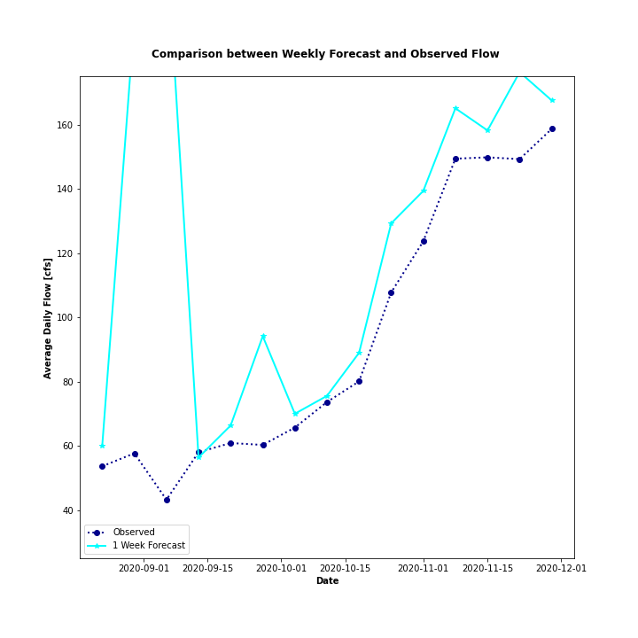
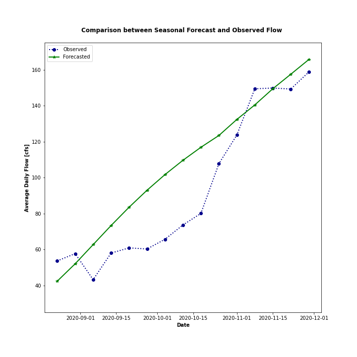

# Forecast Week 15 - ReadMe File
## *Name:* Camilo Salcedo
## *Date:* December 7th 2020

## Table of Contents:
1. [ Week 15 Forecasts ](#forecasts)
2. [ Supercomputing](#superc)

>## 1. Week 15 forecasts

### Weekly Forecasts

For the weekly results, an AR3 model was used. The training period and the coefficient of determination are shown in the table below.

|AR Model|Training Start Date|Training End Date|R^2|
| ------ | ----------------- | --------------- | --- |
| ------ | ----------------- | --------------- | --- |
|Week (1 & 2)|2017-11-01|2017-12-12|0.9819|

As a result, the obtained values for the forecast are:

_**1 Week (2020-11-29 to 2020-12-05):**_ 167.58 cfs

_**2 Week (2020-12-06 to 2020-12-12):**_ 177.18 cfs

The performance of my weekly forecasts along the semester are shown in the graph below.

### Seasonal Forecasts
For Seasonal Forecast, two AR3 Models were used using the parameters shown in the table below.

|AR Model|Training Start Date|Training End Date|R^2|
| ------ | ----------------- | --------------- | --- |
| ------ | ----------------- | --------------- | --- |
|Seasonal - 1st 10 weeks|2017-08-25|2017-11-17|0.8561|
|Seasonal - Remaining weeks|2017-10-01|2017-12-15|0.9886|

As a result, the forecasted values are shown below, measured in [cfs].

| Week 1 | Week 2 | Week 3 | Week 4 | Week 5 | Week 6 | Week 7 | Week 8 | Week 9 | Week 10 | Week 11 | Week 12 | Week 13 | Week 14 | Week 15 | Week 16 |
| ------ | ------ | ------ | ------ | ------ | ------ | ------ | ------ | ------ | ------- | ------- | ------- | ------- | ------- | ------- | ------- |
| 42.34  | 52.05  | 62.71  | 73.35  | 83.5   | 92.98  | 101.69 | 109.65 | 116.88 | 123.45  | 132.37  | 140.47  | 149.45  | 157.52  | 165.67  | 172.92  |

The performance of my weekly forecasts along the semester are shown in the graph below.

>## 2. Supercomputing

#### 1. What resources did you request on Ocelote? How long did you wait in the queue for your job to run and how long did it take to run?

To run my code, I requested in `Ocelote` 1 node with 1 core and 6 GB of total memory. My wait in the queue and the time required to run my code were seconds in both cases. I could not even count them, they were very fast.

#### 2. What was the most confusing part to you about setting up and running your job on Ocelote?
The most confusing part of the process was submitting my run file (run_week15.pbs). The main reason was that I compared line by line with Laura's example in class, and everything seems to be working. Thanks to Diana, she noticed an issue with that file regarding with its format. This issue was solved by using _dos2unix_ to convert the pbs file into an adequate format.

In addition, I created some graphs to show the performance of my forecasts in comparison with the observed information. However, as I used Python 3.8.5 in VS Code, _Ocelote_ was not able to run it because its Python version is 3.6. Reading into HPC Webpage, only _El Puma_ is able to run version 3.8.5.

The setting up and running of our job was pretty straightforward thanks to Laura's instructions.

#### 3. Where else did you run your job? How did the setup compare to your run on Ocelote?
I decided to run the code into Google Colab. To accomplish this, I modified the code and prepare a Jupyter Notebook, to upload it to the platform.

In the link below, you can find my Jupyter notebook in Google Colab, with its corresponding results.

[Link to my Notebook](https://colab.research.google.com/drive/1lj5EMLO1DSplQSXycbc8x7kBKIw6xMlM?usp=sharing)

#### 4. What questions do you still have after doing this?
For now I don't have any more questions. However, I am glad to lear about the high performance computation in order to use it in further steps of my PhD. Thank you!
