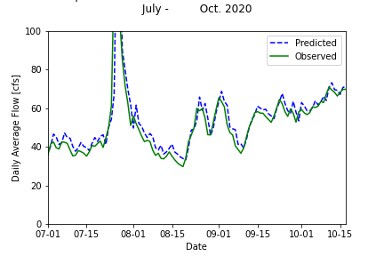
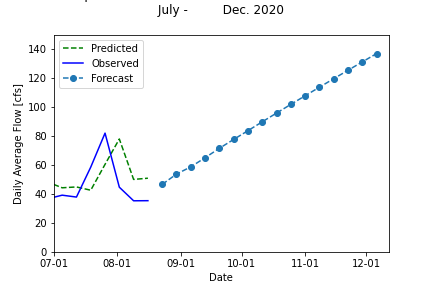

# Forecast Week 8 - ReadMe File
## _Code Submission # 1_
## *Name:* Camilo Salcedo
## *Date:* October 19th 2020
___
#### Grade 
 - 6/6  Great  job!
 - Readability: 3
 - Style: 3 
 - Code: 2

 - Really cool that you made a function that calls another function! 
 - Also great job having a function with multiple returns. 
 - I made a suggestion to shorten your function

### 1. A brief summary of the AR model you built and why. Use whatever graphs you find helpful.
For this week, I used two AR models of order 3 to perform the forecasts. Despite the training periods for the models were almost the same, the sampling time for the used data was different: For the weekly forecast, a daily flow data was considered, meanwhile a weekly flow data was considered for seasonal forecast.

The selection of the AR model's order followed the determination coefficient R2. First, the training period was selected based on an analysis performed in previous weeks. In that analysis, it was observed that for the the months of July, August and September of 2020, the year that showed the most similar behavior for the flow was 2019. Hence, the training period was selected between Aug. 25/2019 to Nov. 17/2019. Secondly, using the developed function to fit an AR model, 4 models were considered by testing time shifts between 1 and 5. As a result, for the aforementioned conditions, the R2 did not change significantly for more than 3 time shifts, selecting that order for the model.

When the forecasts were generated, the AR(3) model used for the weekly forecasts with daily information had an R2 of 0.9295. However, when using the same model for a long term (seasonal forecast), the model converged to one single value for the last two months. Based on this, I decided to use weekly-based data for developing a long term model (seasonal), while daily-based data for modeling the short term (weekly). To support the obtained results, the plots below shows the good fit for an AR(3) model for short term forecast, and the weak-behaved AR(3) model for the long term forecast using weekly data, after noticing the converging value for the time series.

    

### 2. An explanation of how you generated your forecasts and why (i.e. did you use your AR model or not?)
The weekly forecast were generated using the AR(3) model described in Question # 1, using the available information up to October 17th 2020.

For the seasonal forecast, I reported the same forecasts as in Week 6 given that I used an AR model then :(. However, when my code is executed, a slightly better approach for the seasonal forecast is shown, resampling the data by including the left interval, and the label at the left of it (start of the week).

### 3. A brief summary of what you got out of the peer evaluation. How did you make your script better?
Based on the peer evaluation, I could figure out two different things. First, from the evaluation that Danielle made me, this time I was very aware of using the PEP8 standards. On last week's submission, I did not focus on the spaces between operators, as well as the indentation, so my code was not meeting the standards totally.

Secondly, from the evaluation I did to Ben, I could figure out a better way to perform and store the forecasts appending the results to a dataframe.

### 4. Describe the part of your script that you are most proud of and why.
The part of my script that I am most proud of is the development of a function to perform the forecasts _forecast_flows_. This function calls another function (_AR_model_estimate_) developed for estimating the parameters of the AR Model, and then is capable of collecting a dataframe with the results.

Among the benefits from the developed function, it can be included the possibility to try different AR models without changing the code. Moreover, the main advantage of the forecasting function is that despite the aggregation of data (weekly or daily), the funtion is capable of performing the forecast efficiently, and printing it.
