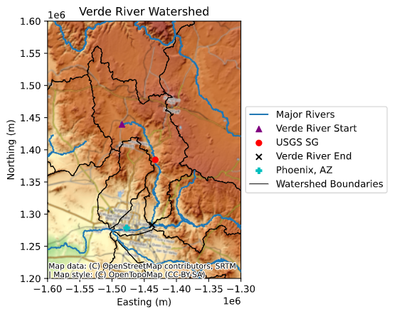
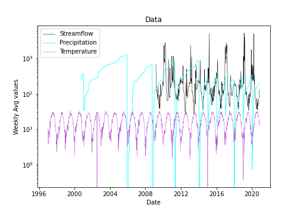
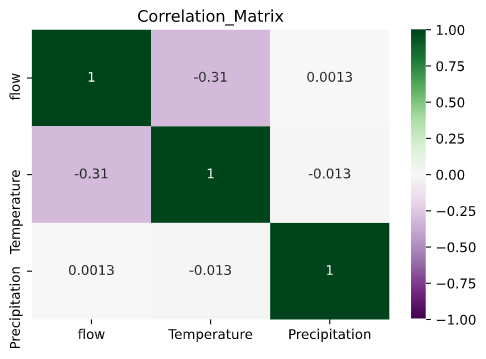

## Homework #11: Team Forecast
## Team Name: *The Aquaholics* :ocean:
#### (The best ones! :sunglasses: )

### Team Members:  *Diana, Danielle, Camilo & Xenia*.
### Date: *November 9, 2020*.

---

### Table of Contents:
1. [ Weekly Forecast](#weekly)
2. [ Team Collaboration](#team)
3. [ Summary](#summary)

---

>### **Weekly Forecast for submission :chart_with_upwards_trend:**

The one and two week forecast streamflow values for your teams.
- Week 1: 129.29 cfs
- Week 2: 143.42 cfs

---

>### **Team Collaboration :muscle:**

- A brief summary of your collaboration. What did each team member bring to the table, who did what and how did you decide how to combine things?

Camilo brought his wonderful, working autoregressive model and improved the functions as well as the seasonal forecast to make a better, more compact script.  

Diana made a fantastic map of our watershed, incorporating shape files from various sources that were agreed to by the group.

Xenia made the template for this markdown and made the plots of the correlation matrix and of data from Mesowest against streamflow.

Danielle moved the functions into another python script and made sure they were read in properly. Too easy, so she also wrote the words for this markdown.

We made copies of Camilo's original code and discussed changes on a discord server created by Camilo. We also coordinated on Discord whenever we were making changes to the main python script or any other files and about to push to Camilo's repo (the main repo). Our plan and task division was determined Thursday during class and everyone worked together marvelously.

10/10, would work with them again.

---

>### **Summary :octocat:**

- A summary of your forecast. This should be written as a narrative summary without any blocks of code. It should summarize the inputs and approach used and must include at least 1 map and one graph. Only include graphs that you talk about in your narrative.

We compared precipitation and temperature from Mesowest with streamflow and discovered streamflow increased when temperature decreased, and vice versa when precipitation increased (Fig. 2).  However, after computing the R^2, we discovered that both variables are very poor for predicting streamflow (Fig. 3).  We believe this could be because there are external factors affecting streamflow in our watershed, which can be seen in the map (Fig. 1).  

Thus, for our team forecast we decided to go with an autoregressive model originally developed by Camilo, which has an excellent R^2 using only 3 time shifts (Table 1).  We believe there are two key factors with our model that produced such high coefficients of determination: 1) not aggregating to weekly and 2) using a certain training period.  The training periods were previously tested by Camilo, who selected them based upon flow patterns. at different years.

**Table 1.** AR model coefficients of determination and their training periods using 3 time shifts

|AR Model|Training Start Date|Training End Date|R^2|
| --- |---|---||
|1 and 2 week|2009-10-01|2009-11-30|0.9769|
|Seasonal - 1st 10 weeks|2019-08-25|2019-11-10|0.6546|
|Seasonal - Remaining weeks|2019-10-30|2019-11-30|0.9338|

**Figure 1.** Map of Verde Watershed

**Figure 2.** Mesowest meteorological  data plotted with USGS stream gauge data

**Figure 3.** Correlation Matrix

